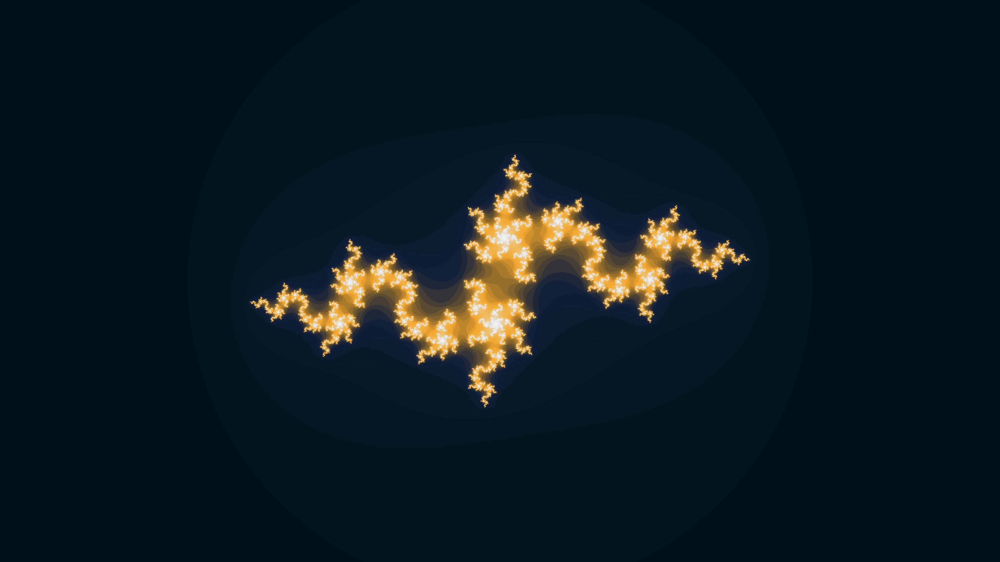

# JuliaSetExplorer


This is an interactive fractal visualiser that lets you walk around the complex plane, generating mesmerising [Julia sets](https://en.wikipedia.org/wiki/Julia_set) as you go. 
Written in Rust, it uses [minifb](https://github.com/emoon/rust_minifb) to display the generated pixels and handle UI. 
It also uses a neat [linear interpolation module](https://github.com/joshcbrown/mandelbrot-rs/blob/main/src/palette.rs) to convert real values to RGB pixels.

## Controls

* Move your mouse: the interactive window represents a region of the complex plane centred at the origin and will display an image of the Julia set that corresponds to the point under your mouse.
* Left/right arrow keys/mouse buttons: change the maximum number of iterations by using the left and right arrow keys or the left and right mouse buttons. 
Left will increase the maximum number of iterations making the image darker but potentially more detailed, right will do the opposite.
* ENTER: reset the maximum number of iterations to the default.
* Hold SPACE: see an image of the Mandelbrot set in the same region of the complex plane. 
This serves as a kind of map, as the Julia sets generated for a given point will [resemble](https://en.wikipedia.org/wiki/Julia_set#/media/File:Julia_Mandelbrot_Relationship.png) the region of the Mandelbrot set around that point.

## Run

You can always clone and run
```
cargo run --release
```
but since the resulting executables are so small I've also included them in the repo for those on:
* [Linux](./executables/linux/julia_set_explorer.zip)
* [MacOS](./executables/mac/julia_set_explorer.zip)
* [Windows](./executables/windows/julia_set_explorer.exe.zip)


Just download and unzip. You might have to right-click and select open after unzipping.

## Examples

Here are some static examples, however they are no substitute for seeing the colours morph and twist dynamically.




